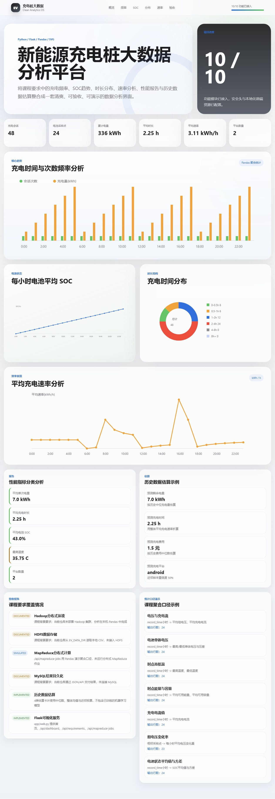

# 电动汽车充电桩数据分析平台

来源于第 6 组课程实训成果，当前仓库为公开整理演示版。本人负责公开版的代码整理、页面调整与运行验证，结合 AI 完善依赖配置、运行说明和展示效果。

课程原分工中，本人负责 Hadoop 环境与部署，Flask 业务接口及前端可视化由团队其他成员承担；当前公开版的整理工作与课程原始分工分别说明。仓库内容不代表本人独立完成原课程的全部功能。

使用 Python、Flask、Pandas 和原生 HTML/CSS/JavaScript，将充电会话与电池时序数据整理为统计指标、交互导航及 SVG 图表。分析逻辑、Web 服务和前端渲染分层组织。

## 运行效果



截图使用合成演示数据，展示当前版本界面；不代表课程真实数据统计结果。

## 功能

- 按小时统计充电次数与充电电量。
- 计算每小时平均 SOC、充电时长分布及平均充电速率。
- 展示电池温度、单体电压、容量与充电行为的统计指标。
- 基于历史中位数、整体平均速率和近邻投票，展示电量、时长、费用、平台的估算示例。
- 通过 Flask JSON API 将分析结果交给前端，前端使用 DOM API 和 SVG 绘图。
- 提供数据读取、清洗、统计、API、安全响应头及前端静态检查测试。

当前版本在本机使用 Pandas 计算，没有部署 Hadoop/HDFS 集群，也没有接入 MySQL。估算卡片不代表经过训练与评估的机器学习模型；代码保留部分课程背景接口，具体状态在页面中说明。

## 环境与数据

建议使用 Python 3.11 或更新版本。数据集因版权不含在本仓库，`data/` 目录请自备。需要以下两个 CSV 文件：

| 文件 | 必需字段 |
| --- | --- |
| `nvv2t_md.csv` | `sessionId`、`kwhTotal`、`charging_fees`、`created`、`ended`、`startTime`、`endTime`、`chargeTimeHrs`、`weekday`、`platform`、`facilityType`、`managerVehicle` |
| `dsv13r2.csv` | 带表头的 11 列，依次为设备编号、记录时间、SOC、组电压、充电电流、最高/最低单体电压、最高/最低温度、可用能量、可用容量 |

电池记录时间使用 `YYYYMMDDHHMMSS`；月份、日期应已修正为合法值。会话小时字段为数值。项目会清洗无法解析的数据，并排除非正充电电量或时长；时长分布的 `8h+` 包含所有超过 8 小时的记录。

## 运行

在仓库目录打开 PowerShell：

```powershell
python -m venv .venv
.\.venv\Scripts\python.exe -m pip install -r requirements.txt
# 若 CSV 放在仓库的 data/ 目录，可以省略下面这一行。
$env:EV_DATA_DIR = 'D:\datasets\ev-charge'
.\.venv\Scripts\python.exe -m app.web
```

Linux/macOS 使用 `python3 -m venv .venv`，通过 `export EV_DATA_DIR=/path/to/datasets` 指定数据目录，然后执行 `.venv/bin/python -m app.web`。

浏览器访问 <http://127.0.0.1:5000>。未配置数据时首页和 `/health` 仍可访问，数据 API 返回 503 及配置提示；读取后没有有效记录时返回 422。

主要接口：

| 接口 | 用途 |
| --- | --- |
| `GET /api/dashboard` | 驾驶舱指标和图表数据 |
| `GET /health` | 服务健康检查 |

## 测试

```powershell
.\.venv\Scripts\python.exe -m pytest tests -q
node --check static/app.js
```

测试数据由 `tests/conftest.py` 在临时目录合成，不需要真实课程数据集。

## 目录

```text
app/                         数据读取、统计与 Flask API
static/                      HTML、CSS、JavaScript 和 SVG 图表
tests/                       合成数据及自动化测试
tools/build_deliverables.py   可选课程文档生成工具
requirements.txt             运行与测试依赖
requirements-deliverables.txt 可选文档生成依赖
```

`tools/build_deliverables.py` 需要先安装 `requirements-deliverables.txt`，并配置有效数据；输出写入被 Git 忽略的 `deliverables/`。课程报告、答辩 PPT、原始数据及个人资料不作为本仓库内容发布。

## 安全与使用范围

默认只监听 `127.0.0.1:5000`，Flask debug 默认关闭。统一设置 CSP、MIME 类型保护、点击劫持防护和请求体大小限制；前端用 `textContent` 与 DOM API 渲染，不拼接 HTML 字符串。

当前版本用于本机课程演示，没有认证和授权模块。安全检查范围与已知限制见 [检查说明](security_best_practices_report.md)。
